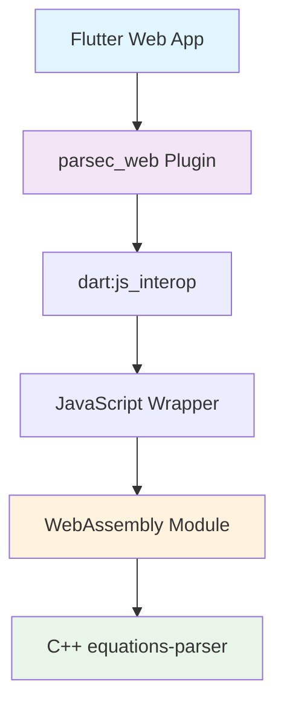

# parsec_web [](https://pub.dev/packages/parsec_web)

The **Web implementation** of the [`parsec`](../parsec) plugin, providing high-performance mathematical equation evaluation through **WebAssembly** compiled from C++.

> [!NOTE]
> This package is [endorsed](https://flutter.dev/docs/development/packages-and-plugins/developing-packages#endorsed-federated-plugin), which means you can simply use `parsec` normally. This package will be automatically included in your app when you target web platforms.

## 🚀 Features

- **⚡ WebAssembly Performance**: Native C++ math library compiled to WASM for optimal speed
- **🔄 Cross-Platform Consistency**: Identical results across all Flutter platforms 
- **📱 Offline-First**: No server dependencies, completely self-contained
- **🎯 Type-Safe**: Full Dart type safety with `dart:js_interop`
- **🧮 Comprehensive**: 100+ mathematical, trigonometric, string, and logical functions

## 📊 Performance Comparison

| Platform | Implementation | Typical Performance | Network Required |
|----------|---------------|-------------------|------------------|
| **Web (WASM)** | C++ → WebAssembly | **~1-10ms** | ❌ No |
| **Android** | C++ via JNI | ~5-20ms | ❌ No |
| **Linux** | C++ via FFI | ~5-20ms | ❌ No |
| **Windows** | C++ via FFI | ~5-20ms | ❌ No |

## 🏗️ Architecture



## 📦 Installation

Add `parsec` to your `pubspec.yaml`:

```yaml
dependencies:
  parsec: ^0.3.1  # Latest version
```

> [!IMPORTANT]
> **Web Setup Required**: For web platforms, you need to include the JavaScript wrapper in your `web/index.html` file:

```html
<!DOCTYPE html>
<html>
<head>
  <meta charset="UTF-8">
  <title>Your App</title>
</head>
<body>
  <!-- Add this script tag -->
  <script type="module" src="packages/parsec_web/parsec-web/js/equations_parser_wrapper.js"></script>
  
  <!-- Your existing Flutter scripts -->
  <script src="flutter.js" defer></script>
</body>
</html>
```

## 🛠️ Development Setup

### Prerequisites

For local development and WASM generation, you'll need:

- **Emscripten** (for compiling C++ to WebAssembly)
- **Node.js** (for running JavaScript tests)

<details>
<summary><strong>📋 Installing Emscripten</strong></summary>

#### Ubuntu/Debian
```bash
sudo apt-get update
sudo apt-get install emscripten
```

#### Manual Installation
```bash
git clone https://github.com/emscripten-core/emsdk.git
cd emsdk
./emsdk install latest
./emsdk activate latest
source ./emsdk_env.sh
```

#### Verify Installation
```bash
emcc --version  # Should show Emscripten version
```
</details>

### 🔨 Generating WebAssembly Files

If you need to regenerate the WebAssembly module (for local development):

```bash
cd parsec_web
dart bin/generate.dart
```

This command will:
- ✅ Check for the parsec-web submodule
- ⚙️ Compile C++ equations-parser (38 source files) to WebAssembly  
- 📦 Generate `wasm/equations_parser.js` (~635KB)
- ✅ Verify all required files are present

> [!TIP]
> You only need to run this if you're modifying the C++ equations-parser library or if the WASM files are missing.

## 💻 Usage

The web implementation provides identical API to other platforms:

```dart
import 'package:parsec/parsec.dart';

void main() async {
  final parsec = Parsec();
  
  // Basic arithmetic
  final result1 = await parsec.eval('2 + 3 * 4');          // 14
  final result2 = await parsec.eval('sqrt(16) + pow(2,3)'); // 12.0
  
  // Trigonometric functions
  final result3 = await parsec.eval('sin(pi/2)');          // 1.0
  final result4 = await parsec.eval('cos(0) + tan(pi/4)'); // 2.0
  
  // String operations
  final result5 = await parsec.eval('concat("Hello", " World")'); // "Hello World"
  final result6 = await parsec.eval('length("Flutter")');         // 7
  
  // Logical operations
  final result7 = await parsec.eval('5 > 3 ? "yes" : "no"'); // "yes"
  final result8 = await parsec.eval('true and false');       // false
}
```

### 🎯 Web-Specific Features

The web implementation leverages WebAssembly for optimal performance:

```dart
// Complex mathematical expressions are evaluated efficiently
final complexResult = await parsec.eval('''
  sum(
    sin(pi/6) * cos(pi/3),
    sqrt(abs(-16)) / 2,
    log10(100) + ln(e)
  )
'''); // Fast WASM execution
```

## 🧪 Testing

### Running JavaScript Tests

Test the WebAssembly module directly:

```bash
cd parsec_web/lib/parsec-web
npm install
npm test
```

### Running Flutter Web Tests

Test the full integration:

```bash
cd parsec
flutter test --platform chrome test/parsec_web_integration_test.dart
```

## 🔍 Supported Functions

<details>
<summary><strong>📚 Complete Function Reference</strong></summary>

### 📐 Mathematical Functions
```dart
abs(-5)              // 5
sqrt(16)             // 4.0
cbrt(27)             // 3.0
pow(2, 3)            // 8.0
exp(1)               // 2.718...
round(3.7)           // 4
round_decimal(3.14159, 2) // 3.14
```

### 📊 Trigonometric Functions
```dart
sin(pi/2)            // 1.0
cos(0)               // 1.0  
tan(pi/4)            // 1.0
asin(1)              // pi/2
acos(1)              // 0
atan(1)              // pi/4
sinh(0)              // 0
cosh(0)              // 1
tanh(0)              // 0
```

### 📈 Logarithmic Functions
```dart
ln(e)                // 1.0
log(100)             // 2.0 (base 10)
log10(1000)          // 3.0
```

### 🔤 String Functions
```dart
concat("A", "B")     // "AB"
length("Hello")      // 5
toupper("hello")     // "HELLO"
tolower("WORLD")     // "world"
left("Hello", 3)     // "Hel"
right("World", 3)    // "rld"
str2number("42")     // 42
string(123)          // "123"
```

### 🔢 Aggregation Functions
```dart
min(1, 2, 3)         // 1
max(1, 2, 3)         // 3
sum(1, 2, 3)         // 6
avg(2, 4, 6)         // 4.0
```

### 🧮 Logical Operations
```dart
true and false       // false
true or false        // true
5 > 3                // true
"a" == "a"           // true
5 > 3 ? "yes" : "no" // "yes"
```

### 🔤 Constants
```dart
pi                   // 3.14159...
e                    // 2.71828...
```

</details>

## ⚡ Performance Tips

### Best Practices

```dart
// ✅ Good: Batch multiple calculations
final results = await Future.wait([
  parsec.eval('sin(pi/2)'),
  parsec.eval('cos(0)'),
  parsec.eval('tan(pi/4)'),
]);

// ❌ Avoid: Too many individual evaluations in tight loops
for (int i = 0; i < 1000; i++) {
  await parsec.eval('sqrt($i)'); // Consider batching
}
```

### WebAssembly Optimization

The WebAssembly module is optimized for:
- **Size**: Single file embedding (~635KB)
- **Speed**: Compiled with `-O3` optimization
- **Compatibility**: Works in all modern browsers

## 🐛 Troubleshooting

<details>
<summary><strong>❓ Common Issues & Solutions</strong></summary>

### "parsec-web JavaScript library not found"

**Problem**: The JavaScript wrapper is not loaded in your web app.

**Solution**: 
1. Add the script tag to your `web/index.html`:
   ```html
   <script type="module" src="packages/parsec_web/parsec-web/js/equations_parser_wrapper.js"></script>
   ```

2. Ensure WebAssembly files are present:
   ```bash
   cd parsec_web
   dart bin/generate.dart
   ```

### WebAssembly fails to load

**Problem**: Browser cannot load or execute the WASM module.

**Solutions**:
- ✅ Ensure you're using a modern browser with WebAssembly support
- ✅ Check browser console for detailed error messages  
- ✅ Try hard refresh (Ctrl+Shift+R) to clear cache
- ✅ Verify the WASM file exists: `ls parsec_web/lib/parsec-web/wasm/`

### Build errors during development

**Problem**: Emscripten compilation fails.

**Solutions**:
- ✅ Install Emscripten: `sudo apt-get install emscripten`
- ✅ Verify installation: `emcc --version`
- ✅ Check submodule: `git submodule update --init --recursive`
- ✅ Clean rebuild: `rm -rf parsec_web/lib/parsec-web/wasm/ && dart bin/generate.dart`

</details>

## 🤝 Contributing

1. **Fork** the repository
2. **Create** your feature branch: `git checkout -b feature/amazing-feature`
3. **Generate** WASM files: `cd parsec_web && dart bin/generate.dart`
4. **Test** your changes: `flutter test --platform chrome`
5. **Commit** your changes: `git commit -m 'Add amazing feature'`
6. **Push** to the branch: `git push origin feature/amazing-feature`
7. **Open** a Pull Request

## 📄 License

This project is licensed under the **Apache-2.0** license - see the [LICENSE](../LICENSE) file for details.

## 🔗 Related Packages

- [`parsec`](../parsec) - Main plugin package
- [`parsec_platform_interface`](../parsec_platform_interface) - Common interface
- [`parsec_android`](../parsec_android) - Android implementation  
- [`parsec_linux`](../parsec_linux) - Linux implementation
- [`parsec_windows`](../parsec_windows) - Windows implementation

---

<div align="center">

**[📚 Documentation](../parsec) • [🐛 Issues](https://github.com/your-repo/parsec_flutter/issues) • [💬 Discussions](https://github.com/your-repo/parsec_flutter/discussions)**

Made with ❤️ for the Flutter community

</div>